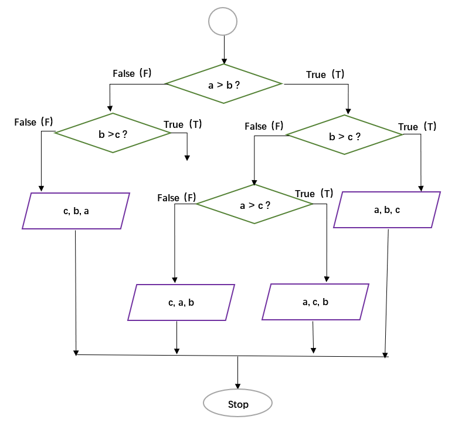

**Out: 09/17 19:00 **  
**Due: 10/10 19:00 **  

For problem set *i*, create a script named `PS1_i.R`. Upload your R scripts and report to the `ESE5023_Assignments` repository.

***

# Instructions  

**Collaboration:**  
Collaboration on solving the assignment is allowed, after you have thought about the problem sets on your own. It is also OK to get  clarification (but not solutions) from online resources, again after you have thought about the problem sets on your own. There are two requirements: 

* Cite your collaborators **fully and completely** (*e.g.*, “XXX explained to me what is asked in problem set 3”). Or cite online resources (*e.g.*, “I got inspired by reading XXX”) that helped you.
* Write your scripts and report **independently** - the scripts and report must come from you only.

**Late Submission:**   
Late submissions will not receive full credit. **Half credit** will be awarded to correct solutions submitted within **24 hours** of the original deadline. Otherwise, no credit will be given. 

**Submitting your assignment:**  
Submit your scripts and report via GitHub. The submission time will be determined based on your GitHub records.  

***

# 1. Flowchart 

**[5 points]** Write a function `Print_values` with arguments `a`, `b`, and `c` to reflect the following flowchart [^1]. Here the red-ish parallelogram operator is to print values in the given order. Report your output with some random `a`, `b`, and `c` values.  

[^1]: [Source](https://www.tenouk.com/clabworksheet/labworksheet8_files/cifelseswitchcase031.png)

***

# 2. Matrix multiplication

**2.1 [5 points]** Make two matrices `M1` (`5` rows and `10` columns ) and `M2` (`10` rows and `5` columns ); both are filled with random integers from `0` and `50`.

**2.2 [5 points]** Write a function `Matrix_multip` to do matrix multiplication, *i.e.*, `M1 * M2`. Here you are only allowed to use `for` loop, `*` operator, and `+` operator. Verify your result with the built-in `%*%` operator.

***

# 3. Pascal triangle

**[10 points]** One of the most interesting number patterns is [Pascal's triangle](https://www.mathsisfun.com/pascals-triangle.html) (named after Blaise Pascal). Write a function `Pascal_triangle` with an argument `k` to print the *k*^th^ line of the Pascal triangle. Report `Pascal_triangle(100)` and `Pascal_triangle(200)`.

***

# 4. Add or double

**[15 points]** If you start with 1 RMB and, with each move, you can either double your money or add another 1 RMB, what is the smallest number of moves you have to make to get to exactly *x* RMB? Here *x* is an integer randomly selected from `1` to `100`. Write a function `Least_moves` to print your results. For example, `Least_moves(2)` should print `1`, and `Least_moves(5)` should print `3`.

(Hint: You may find `combinations()` or `permutations()` in the `gtools` package useful)

***

# 5. Dynamic programming

Insert `+` or `-` operation anywhere between the digits `123456789` in a way that the expression evaluates to an integer number. You may join digits together to form a bigger number. However, the digits must stay in the original order. 

**5.1 [15 points]** Write a function `Find_expression`, which should be able to print every possible solution that makes the expression evaluate to a random integer from `1` to `100`. For example, `Find_expression(50)` should print lines include:
$$ 1 - 2 + 34 + 5 + 6 + 7 + 8 - 9 = 50 $$
and
$$ 1 + 2 + 34 - 56 + 78 - 9 = 50 $$

**5.2 [5 points]** Count the total number of suitable solutions for any integer *i* from `1` to `100`, assign the count to `Total_solutions[i]`. Plot the vector `Total_solutions`, so which number(s) yields the maximum and minimum of `Total_solutions`? 

(Hint: You may find `seq()`, `combinations()`, and `permutations()` useful)

***

# 6. Visibility in Shenzhen during the past 10 years

In this problem set, we will examine how visibility changes in Shenzhen during the past 10 years. Recall the `2281305.csv` you used for [Exercise #3](https://zhu-group.github.io/ese5023/Section_03.html#Exercise_3) in Section 03. Hourly visibility data are stored under the `VIS` column. Read page `10` of the comprehensive [user guide](https://www.ncei.noaa.gov/data/global-hourly/doc/isd-format-document.pdf) for the detailed format of the data.

You want to only use data points satisfying the following criteria:

* Visibility data (in meters) within the range of `0` and `160000`
* Pass all quality control checks: `VISIBILITY-OBSERVATION distance quality code` is `1`, `VISIBILITY-OBSERVATION variability code` is `N`, and `VISIBILITY-OBSERVATION quality variability code` is `1`.

**6.1 [15 points]** Plot hourly visibility data as a function of the observation time, similar to the time series plot you made in [Exercise #3](https://zhu-group.github.io/ese5023/Section_03.html#Exercise_3). Based on your naked eyes, is there a trend in visibility during the past 10 years? 

**6.2 [10 points]** For each year, report the number of days with visibility within the following intervals: `[0,5)`,`[5,10)`,`[10,15)`,`[15,20)`,`[20,25)`,`[25,30)`, and `>=30`. Is the visibility getting better or worse?

***

# 7. Explore a data set

Browse the [CASEarth website](http://data.casearth.cn/). Search and download a data set you are interested in. Your data set should be in `csv` or `XLSX` format, and have temporal information. In R, do the following:  
**7.1 [5 points]** Load the `csv` or `XLSX` file, and clean possible data points with missing values or bad quality.  
**7.2 [5 points]** Plot the time series of a certain variable.  
**7.3 [5 points]** Conduct at least `5` simple statistical checks with the variable, and report your findings.

