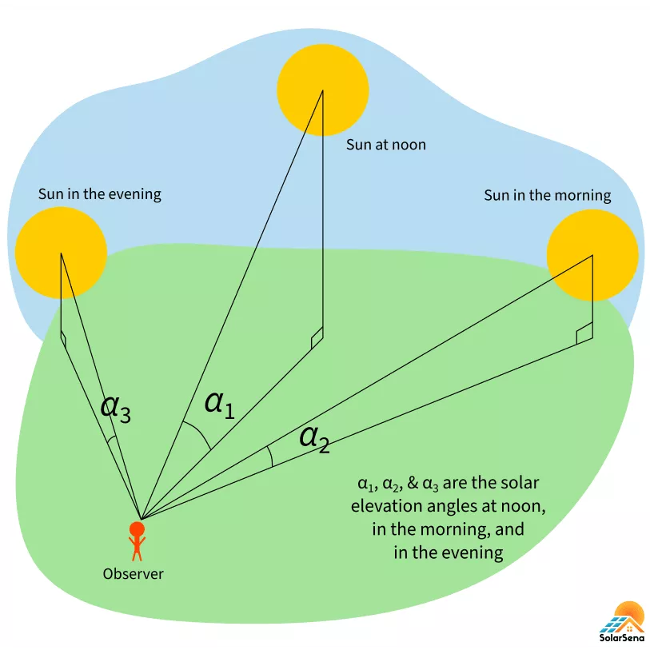

**Out: 12/08 19:00 **  
**Due: 12/22 19:00 **  

***

# Instructions  

**Collaboration:**  

Collaboration on solving the assignment is allowed, after you have thought about the problem sets on your own. It is also OK to get clarification (but not solutions) from online resources, again after you have thought about the problem sets on your own. There are two requirements: 

* Cite your collaborators **fully and completely** (*e.g.*, "XXX explained to me what is asked in the problem set 2"). Or cite online resources (*e.g.*, "I got inspired by reading XXX") that helped you.

* Write your commands and report **independently** - the commands and report must come from you only.

**Submitting your assignment:**  

* Create `Fortran` scripts. 

* Please write a report `PS6.pdf`. 

* Upload the report and `Fortran` scripts to your Github `ESE5023_Assignments_XXX` repository (where `XXX` is your SUSTech ID) before the due time.

**Late Submission:**   

Late submissions will not receive any credit. The submission time will be determined based on your latest GitHub file records.

***

# 1. Matrix multiplication

**1.1 [5 points]** Write a program `Main.f90` to read `fortran_demo1/M.dat` as the matrix `M`, and  `fortran_demo1/N.dat` as the matrix `N`.

**1.2 [5 points]** Write a subroutine `Matrix_multip.f90` to do matrix multiplication. 

**1.3 [5 points]** Call the subroutine `Matrix_multip()` from `Main.f90` to compute `M*N`; write the output to a new file `MN.dat`, values are in formats of `f9.2`.

***

# 2. Calculate the Solar Elevation Angle

The solar elevation angle (SEA) is the angle between the imaginary horizontal plane on which you are standing and the sun in the sky. SEA is very important in deciding the inclination of solar panels, in both photovoltaics (PV) and thermal. The value of the SEA depends on the location on the Earth and the local date and time.

Please read this [Solar Elevation Angle – Calculating Altitude of Sun](https://solarsena.com/solar-elevation-angle-altitude/) and links therein for how to calculate SEA.

  

[Figure source](https://solarsena.com/solar-elevation-angle-altitude/)

**2.1 [5 points]** Write a module `Declination_angle` that calculates the *declination angle* on a given date. 

[**Hint:** using the "Better formula" from [Solar Declination Angle & How to Calculate it](https://solarsena.com/solar-declination-angle-calculator/)]

**2.2 [10 points]** Write a module `Solar_hour_angle` that calculates the *solar hour angle* in a given location for a given date and time.

[**Hint:** using the formulas from [Solar Hour Angle & How to Calculate it](https://solarsena.com/solar-hour-angle-calculator-formula/)]

**2.3 [5 points]** Write a main program (`Solar_elevation_angle.f90`) that uses module `Declination_angle` and `Solar_hour_angle` to calculate and print the SEA in a given location for a given date and time.

**2.4 [5 points]** Create a library (`libsea.a`) that contains `Declination_angle.o` and `Solar_hour_angle.o`. Compile `Solar_elevation_angle.f90` using `libsolar.a`. Print the SEA for Shenzhen (`22.542883N, 114.062996E`) at `10:32` (Beijing time; UTC+8) on `2021-12-31`.
