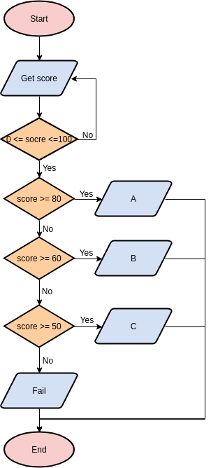

***

## 1. Flowchart

A [Flowchart](https://www.programiz.com/article/flowchart-programming) is a diagrammatic representation of an algorithm. It can be helpful for both writing programs and explaining the program to others. A Flowchart is very useful in programming, as it explains a process clearly through symbols and text. Moreover, a flowchart gives you the gist of the process flow in a single glance. 

Here we begin to learn the flowchart with `if` and `else` in `Python`. Copy the following lines into your script:

```{python eval=FALSE}
# importing "random" for random operations
import random

# Using random() function to generate one random value between 0 and 1
Score  = round(random.random()*100)
print(Score)

# Get level
if (Score >= 90):
  print("Excellent") 
elif (Score >= 60):
  print("Pass")
else:
  print("Fail")
```

* Selecting all the lines, and then run the script, what is your result in **Console**?  Here `Score` is randomly generated using `random()` function from the `random` library. Type `help(random)` for help. You can play with this script a few times to get different outputs.

* Draw a flow chart based on this script.  

* Update your script to reflect the following flowchart.



***

# 2. Building a guessing game

+ Set a secret integer from `0` to `9`, name the integer `answer`. Make sure your deskmate does not know the secret number.

+ Write a function that does the following: if your deskmate is able to guess your secret number correctly, print `You Win!`, otherwise print `You Lose! I Win!`

+ Let your deskmate play the game. 

+ Now it's your turn to play your deskmate's game.

***

# 3. Rock, paper, and scissors

In this mini-project, we will build a rock, paper, scissors game in the following steps:

+ Define a list `["rock", "paper", "scissors"]`, use `choice()` function from `random` module to randomly select an element from the list, name it `computer_choice`.

+ Now ask for user input. The input value should be in the list. Name the input `your_choice`.

+ Using `if`, `elif`, and `else` to determine who wins.

***

# 4. Using `Jupyter Notebook`


Jupyter is a loose acronym meaning `Julia`, `Python`, and `R`. The word "notebook" denotes documents that contain **both code and rich text elements**, such as figures, links, equations, etc. Because of the mix of code and text elements, these documents are the ideal place to bring together an analysis description, and its results, as well as, they can be executed perform the data analysis in real time.

`Jupyter` is a free, open-source, interactive web tool known as a computational notebook, which researchers can use to combine software code, computational output, explanatory text and multimedia resources in a single document. Jupyter is recommended by *Nature* as [data scientists’ computational notebook of choice](https://www.nature.com/articles/d41586-018-07196-1). 

+ `Jupyter` is installed along with `Anaconda`. Open `Anaconda Powershell Prompt (anaconda3)`, change working directory using `cd`. 

+ Type and run `jupyter notebook`. This will open your default web browser, and Jupyter dashboard will show up.

+ Create a new note by clicking `New` then `Python3 (ipykernel)`.

+ Go over `User Interface Tour` under the `Help` tab to familiarize yourself with the layout.

+ Copy the following lines to a cell, run the cell, see what happens. We will take a closer look at `matplotlib` in the future sections.

```{python, eval=F}

# import matplotlib
import matplotlib.pyplot as plt

# Get some data
temperatrue = [15.4, 16.3, 19.0, 22.7, 26.0, 28.0,
               28.9, 28.7, 27.7, 25.3, 21.2, 17.0]
month = range(1,13)

# Plot a line
plt.plot(month, temperatrue)

# Add x and y labels
plt.xlabel("Month")
plt.ylabel("Temperature")

# Add figure title
plt.title("Monthly mean temperature in Shenzhen (degree)")

# Show plot
plt.show
```

+ Feel free to look around, refer to [Python For Data Science Cheat Sheet Jupyter Notebook](https://zhu-group.github.io/ese5023/download/python-cheatsheets_Jupyter.pdf) if you have any questions.

Here are some further readings for `Jupyter Notebook`:

+ [How to Use Jupyter Notebook in 2020: A Beginner’s Tutorial](https://www.dataquest.io/blog/jupyter-notebook-tutorial/)

+ [Jupyter Notebook Quickstart](https://test-jupyter.readthedocs.io/en/latest/content-quickstart.html)

+ [Jupyter Notebook Users Manual](https://jupyter.brynmawr.edu/services/public/dblank/Jupyter%20Notebook%20Users%20Manual.ipynb) (more on Markdown)

+ [The Jupyter Notebook official documentation](https://jupyter-notebook.readthedocs.io/en/latest/)

+ [Jupyter IPython official documentation](https://nbviewer.jupyter.org/github/ipython/ipython/blob/3.x/examples/Index.ipynb)
