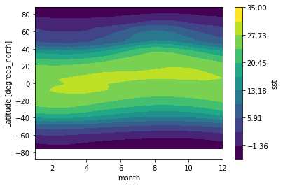

***

# 1. Global sea surface temperature

In this exercise, we will use the [NOAA Extended Reconstructed Sea Surface Temperature (SST) v5 product](https://psl.noaa.gov/data/gridded/data.noaa.ersst.v5.html), a widely used and trusted gridded compilation of historical data going back to `1854`.

**1.** Download the `sst.mnmean.nc` (~ `90 MB`). Read it with `xarray` as the data object `ds`. 

**2.** Plot mean SST in the latest month. Show a 2-D figure.

**3.** Plot a time series of global monthly mean SST from `1900-01` to `2021-12`.

**4.** It turns out that the previous figure is not correct, since it didn't account for the real area of the `2 degrees x 2 degrees` grids. For this exercise, let's create a `weights` array proportional to the cosine of latitude, as the correct area-weighting factor for data on a regular lat-lon grid. 

**5.** Now use `weights` array to compute and plot the correct global monthly SST `1854-01` to `2022-10`. You results show look like this:

  

**6.** Plot the averaged global SST at `June`. Show a 2-D figure.

**7.** Plot the monthly climatology at a point (`114.55E, 19.15N`) in the South China Sea. Show a 1-D figure.

**8.** Plot a contour map of the zonal mean climatology. Show a 2-D figure. You results show look like this:

  

[Hint: use the `plot.contourf()` function]

**9.** Remove the seasonal cycle from `sst`, and plot a timeseries of the anomalies at the point (`114.55E, 19.15N`).

**10.** Run the following lines:

```{python, eval=F}
# Group data by month
group_data = ds.sst.groupby('time.month')

# Apply mean to grouped data, and then compute the anomalies 
sst_anom = group_data - group_data.mean(dim='time')
sst_anom

# Use resample() function at a frequency of 3 years
resample_obj = sst_anom.resample(time="3Y")

# Show the resample object
resample_obj

# Apply mean() function to the resample object and get results
ds_anom_resample = resample_obj.mean(dim="time")
ds_anom_resample

# Plot anomalies
sst_anom.sel(lon=114.55+180, lat=22.5, 
             method='nearest').plot()

# Plot 3-year averaged anomalies
ds_anom_resample.sel(lon=114.55+180, lat=22.5, 
                     method='nearest').plot()
```

Check [xarray.Dataset.resample](http://xarray.pydata.org/en/stable/generated/xarray.Dataset.resample.html) to teach yourself how to use the `resample()` function. Now resample the anomalies at a frequency of `180` days, replot, and what do you observe?

**11.** Run the following lines:

```{python, eval=F}
# Compute rolling means
ds_anom_rolling = sst_anom.rolling(time=12, center=True).mean()

# Show rolling means
ds_anom_rolling

# Plot anomalies
sst_anom.sel(lon=114.55+180, lat=22.5, method='nearest').plot(
    label="monthly anomalies")

# Plot 3-year averaged anomalies
ds_anom_resample.sel(lon=114.55+180, lat=22.5, method='nearest').plot(
    label="3-year resample")

# Plot 12-month rolling mean
ds_anom_rolling.sel(lon=114.55+180, lat=22.5, method='nearest').plot(
    label="12-month rolling mean")

# Add the legend
plt.legend()
```

Check [xarray.DataArray.rolling](http://xarray.pydata.org/en/stable/generated/xarray.DataArray.rolling.html) to teach yourself how to use the `rolling()` function. Now compute the rolling means a frequency of `3` years, replot, and what do you observe?

**12.** Make a timeseries of the anomalies within the lat range (`20S`-`20N`) and lon range (`170`E to `170 W`), show resample means and rolling means at the desired frequencies. Use the tips we covered in the [ Section 08](https://zhu-group.github.io/ese5023/Section_08.html), modify the plot as much as you can.
