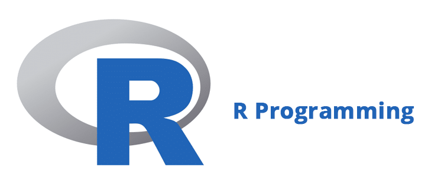
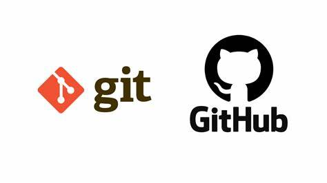
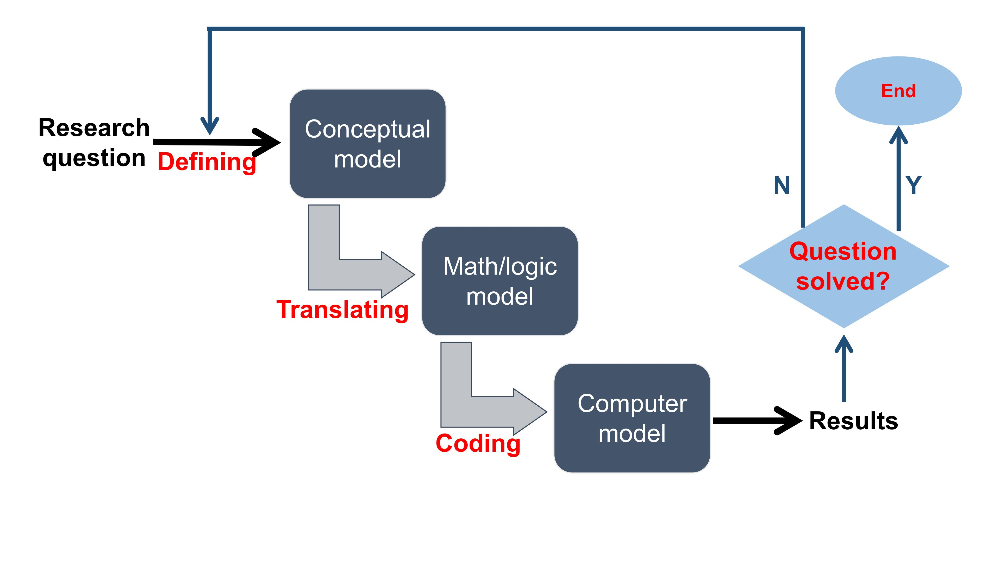

> Without coding, computers would literally ***do nothing***. They would be completely useless. That’s because source code is the set of instructions that tells the computer what to do. Computers have no free will, after all, so without explicit instruction, they’re just sophisticated hunks of metal. [^1]

[^1]: By Travis Addair, Software Engineer, on Quora.

# Background Poll

***1. Are you familiar with following languages?***  

  * FORTRAN  
  * C  
  * C++
  * Java
  * Other
  * I know Chinese, English, maybe some Cantonese

***2. Do you use following languages for data analysis?***  

  * MATLAB  
  * Python  
  * R
  * IDL
  * Other
  * No, I don't

***3. What do you use for data visualization?***  

  * MATLAB  
  * Python  
  * R
  * IDL
  * Origin
  * Other (but not Excel or similar spreadsheet softwares)
  * I use Excel, sometimes Powerpoint 

***4. What is your laptop's operating system (OS)?***  

  * Windows  
  * MacOS  
  * Ubuntu
  * Other

***5. Do you know how to use command lines?***

  * Yes, I know DOS  
  * Yes, I know Linux/Unix  
  * What's a command line?

***6. In your view, why is programming important?***  

***7. In your view, why is programming difficult? *** 
  
***8. Name one thing you want to achieve at the end of the semester***  

***

# Course topics





* Three languages: R, Shell (BASH), and FORTRAN
* One operation system: Linux  
* At the end of the semester, you should be able to:
  + Handle common file formats with R
    - plan text, .csv, .nc, .hdf, etc.
  + Do statistical sleuth with R
    - comparing distributing, ANOVA, regressions, etc.  
  + Make time series analysis with R
    - MA, AR, seasonal decomposition, ARIMA, forecasting,  etc.
  + Conduct spatial analysis with R
    - raster and shape files, interpolation, spatial regression, etc. 
  + Create publication-quality figures with R
    - ggplot, image, lattice, etc.
  + Use Git for version control
    - Github, GitKraken, etc.
  + Write, compile, and run FORTRAN scripts
    - gfortran, ifort, basics, functions, modules, etc.
  + Use Linux environment
    - basics, BASH scripts, installing software, modules, etc.
  + Run jobs on TaiYi high-performance computer
    - SSH, managing jobs, scp, etc.
  + [Optional] Build personal research website
    - Rmarkdown (In fact, this website is made with Rmarkdown)

# Course structure

* Thursday class   
  + New material demonstrated (~ 1 hour)
  + In-class exercises (~ 1 hour)

* Tuesday class (odd week only)
  + In-class exercises (~ 1 hour)
  + Working on assignments
  + Discussing the final project
  + One-on-one interactions
  
* Office Hours to discuss specific questions  

# Should you take the course?

> This course is designed for ESE graduate students having ***no or weak*** programming background, with emphasis on R, FORTRAN, Git, and Linux

> By taking the course, you commit yourself to working on ***time-consuming*** assignments and final project

* Good reasons for ***not*** taking the course:
  + After browsing the [syllabus](https://zhu-group.github.io/ese5023/Syllabus.html) and [schedule](https://zhu-group.github.io/ese5023/Schedule.html), there is nothing new for me
  + I have strong programming background with other tools (C, C++, Java, MATLAB, Python, IDL, etc.)
  + I am able to model, analyze, and visualize data sets through programming efforts already
  + I want to learn other programming languages (C, C++, Java, MATLAB, Python, IDL, etc.)
  + I want to take a “easy” class to meet the graduation requirement
  + I don't want to spend much time on the course, instead I want to focus more on my research  

* Bad reasons for ***not*** taking the course:
  + I don’t have coding/programming experience
  + Programming is terrifying, perhaps I can never learn it
  + My project does not require programming efforts

# Course grading   

* Assignments (50%)
* Final project (40%), 
* Class participation (10%)

***

# A closer look at programming process 


Very often, we find programming difficult because we are not breaking down the research question into small parts, which I refer as *conceptual model*, *math or logic model*, and *computer model*. The most important step is to have a **well-defined** *conceptual model*. This involves with simplifying and generalizing your raw question, so that you can describe you question in one sentence. Once you have a well-defined conceptual model, building a math or logic model would become very straightforward. And coding is the just the last step of the programming process where you use suitable languages and tools to let the computer know what you exactly want to do. The above process of programming, however, can not be ideal as you can probably not make it with one shot. In reality, you need to modify those models **iteratively** before finally solving the question, so the chart would be more like as follow.



# An example: Estimation of $\pi$

Now suppose our research question is:

## Question: How to estimate the number of $\pi$? {.tabset .tabset-fade .tabset-pills}

### Your ideas  

Can you think about a few ways to solve this?  

### Hints

If *r* is the radius of a circle, then the surface of this circle is $\pi*r^{2}$. Therefore, if we know the radius of a circle, and the surface of this circle, we can estimate $\pi$. How can we estimate the surface of a circle with a random method. 

A circle (red) in a square (black) is our solution. Indeed, this is very easy to know the surface of a square. It is the square of the length of one of its sides. Do you see where this is leading us? What if we were able to estimate the rate between the surface of the circle and the surface of the square? Then we would know the surface of the circle. 


Finally, we just need to estimate (surfaceCircle/surfaceSquare). We can apply *Monte Carlo method* here. If we uniformly drop *N* random points (blue) in the square and count how many of them are in the circle, then we have a proxy of the quantity surfaceCircle/surfaceSquare. [^2]

[^2]: [Estimation of the number PI – A Monte Carlo simulation](https://www.r-bloggers.com/estimation-of-the-number-pi-a-monte-carlo-simulation/).

## {-}

## The conceptual model

Following above idea, the conceptual model would be: 
The proportion between the number of points within the circle (*n*) and the square (*N*) is equal to surfaceCircle/surfaceSquare.

## The math model

Simply translating the conceptual model, we have 
$$n/N = \pi / 4$$ 

## The computer model

Put this in R, the code would be like [^2]

```{r}
# Define a function to compute pi
Simulation <- function(N){
  c = rep(0,N)
  numberIn = 0
  for(i in 1:N){
    x = runif(2,-1,1)
    if(sqrt(x[1]*x[1] + x[2]*x[2]) <= 1){
      numberIn = numberIn + 1
    }
    prop = numberIn / i
    piHat = prop *4
    c[i] = piHat
  }
  return(c)
}
```
Let's start with drawing 1000 random points
```{r}
# Draw 100 points
TotalDraw <- 1000
Results   <- Simulation(TotalDraw)
# Plot
plot( seq(1,TotalDraw,by=1), Results, type='l', xlab='Step', ylab='pi',lwd=1.5)
abline(h=3.141592,col="red",lty=2)
text(0.25*TotalDraw,3.5,"3.1415926",cex=1,col="red")
print(paste("Mean Pi from the last 100 steps is: ",mean(Results[TotalDraw-99:TotalDraw])))
```

Simulation with 100,000 random points yields a better result
```{r}
# Draw 1E5 points
TotalDraw <- 1E5
Results   <- Simulation(TotalDraw)
# Plot
plot( seq(1,TotalDraw,by=1), Results, type='l', xlab='Step', ylab='pi',lwd=1.5)
abline(h=3.141592,col="red",lty=2)
text(0.25*TotalDraw,3.5,"3.1415926",cex=1,col="red")
print(paste("Mean Pi from the last 100 steps is: ",mean(Results[TotalDraw-99:TotalDraw])))
```  

***

# In-class exercises

* Brainstorm one research question   
* What is the conceptual model?   
* What is the math/logic model?   
