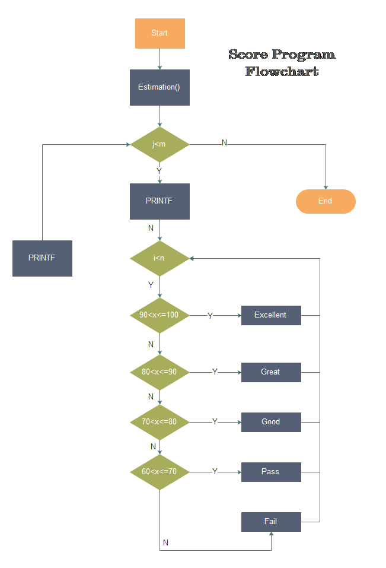

> R is a dialect of the S language, and has come to be — by far — the dominant dialect. [^1]

# Why R?

[^1]: [Why use the R Language?](https://www.burns-stat.com/documents/tutorials/why-use-the-r-language/)

R is the leading tool for statistics, data analysis, and machine learning.  It is more than a statistical package; it’s a ***programming language***, so you can create your own objects, functions, and packages. [^2]  

[^2]: [Why Use R?](https://www.r-bloggers.com/why-use-r/)

Academics and statisticians have developed R over two decades. R now has one of the richest ecosystems to perform data analysis. There are around ***16000 packages*** available in CRAN ([Comprehensive R Archive Network](https://cran.r-project.org/)). It is possible to find a library for ***whatever the analysis*** you want to perform. The rich variety of libraries makes R the first choice for statistical and data analysis. R also makes communicating the findings with a presentation, document, or website very easy. [^3]

[^3]: [R Vs Python: What’s the Difference?](https://www.guru99.com/r-vs-python.html)

The following figure [^4] summaries important reasons for learning R:

[^4]: [Source](https://www.gapintelligence.com/system/pictures/568/content_why-learn-r1.jpg)


***

# First look at RStudio

Follow [instructions](https://zhu-group.github.io/ese5023/Resource.html#RStudio_Desktop) to install RStudio.

The RStudio IDE (Integrated Development Environment) is the most popular integrated development environment for R. It allows you to write, run, and debug your R code.


Check this [cheat sheet](https://github.com/rstudio/cheatsheets/raw/master/rstudio-ide.pdf) for more features and shortcuts of the RStudio IDE.

***

*The notes below are modified from the excellent [online R tutorial](http://swcarpentry.github.io/r-novice-gapminder/) freely available on the Software Carpentry website.*

***

# Introduction to R

## Using R as a calculator

The simplest thing you could do with R is to do arithmetic. Let try this in the **Console** window:

```{r}
1 + 2
```
R will print out the answer with a preceding `## [1]` (my PC) or `[1]` (your laptop). Don’t worry about this for now, we’ll explain that later. For now, think of it as indicating output.  

You will find the spaces have no impact on the result.

```{r}
1+2
```

When using R as a calculator, the order of operations is the same as you would have learned back in school. From highest to lowest precedence:

* Parentheses: `(`, `)`
* Exponents: `^` or `**`
* Multiply: `*`
* Divide: `/`
* Add: `+`
* Subtract: `-`

Let's try

```{r}
1 + 2 * 3
```

```{r}
(1 + 2) * 3
```

```{r}
(1 + 2) ^ 3
```

Always think about clarifying your intentions, as others may later read your code. Here we call such intentions as “comments”. Anything that follows after the hash symbol `#` is ignored by R when it executes code.

```{r}
# Get the square root of 100
100 ^ 0.5
```

Really small or large numbers get a *scientific notation*:
```{r}
2 / 10000
```
You can write numbers in scientific notation too:
```{r}
5e+5 * 1e+5
5.2E+5 + 4.8E+6
```

## Mathematical functions

R has many built-in mathematical functions. To call a function, we can type its name, followed by open and closing parentheses `()`. Anything we type inside the parentheses is called the function’s *arguments*:

```{r}
# Trigonometry functions
sin(1)
sin(0.5*pi)
```

```{r}
# Natural logarithm
log(10)
# Base-10 logarithm
log10(10)
# e^(1/2)
exp(0.5)
```
Don’t worry about trying to remember every function in R. You can look them up online, or if you can remember the start of the function’s name, use the `Tab` completion in RStudio.

This is one advantage that RStudio has over R on its own; it has *auto-completion abilities* that allow you to more easily look up functions, their arguments, and the values that they take. In fact, the auto-completion abilities do not limit to functions, but also to variables.

Typing a `?` before the name of a command will open the help page for that command. When using RStudio, this will open the **Help** window. The help page will include a detailed description of the command and how it works. Scrolling to the bottom of the help page will usually show a collection of code examples that illustrate command usage. We will go back to how to get help later in this section.

## Comparing things

We can also do comparisons in R:

```{r}
# Equality (note two equals signs, read as "is equal to")
1 == 1
# Inequality (read as "is not equal to")
3 != 2  
# Less than
100 < 101  
# Less than or equal to
1e3 <= 2e3
# Greater than
1/3 > 1/5
# Greater than or equal to
-100 > -200
```

A word of warning about comparing numbers: you should never use `==` to compare two numbers unless they are integers (a data type which can specifically represent only whole numbers).

Computers may only represent decimal numbers with a certain degree of precision, so two numbers which look the same when printed out by R, may actually have different underlying representations and therefore be different by a small margin of error (called Machine numeric tolerance). [Further reading]( http://floating-point-gui.de)

Instead, you should use the `all.equal()` function.

```{r}
# Comparing
all.equal(1, 1)
all.equal(1, 1+1e-5)
```

## Variables and assignment

We can store values in variables using the assignment operator `<-`, like this:

```{r}
# Assignment
x <- 1/100
```
Notice that the assignment does not print a value. Instead, we stored it for later in something called a *variable*. `x` now contains the value `0.01`:
```{r}
# Print x
x
```

Remember, you can always print a variable (in fact, anything) using the function `print()`:
```{r}
print(x)
print("Hello World")
```

You can also assign a character to a variable
```{r}
MyName <- "SUSTech"
print(MyName)
```

Look for the **Environment** window from the top right panel of RStudio, and you will see that `x` and its value have appeared. Our variable `x` can be used in place of a number in any calculation that expects a number:
```{r}
# Print x
log10(x)
```
Notice also that variables can be reassigned:
```{r}
# Assignment
x <- 100
```
`x` used to contain the value `0.01`, and now it has the value `100`.

Assignment values can contain the variable being assigned to:
```{r}
# Notice how RStudio updates its description of x on the top right tab
x <- x + 1 
y <- x * 2
```
The right-hand side of the assignment can be any valid R expression. The right-hand side is **fully evaluated** before the assignment occurs.

Variable names can contain letters, numbers, underscores, periods, **but no spaces**. They must start with a letter or a period followed by a letter (they cannot start with a number nor an underscore). Variables beginning with a period are hidden variables. Different people use different conventions for long variable names. Whatever you use is up to you, but be consistent.

## Vectorization

One thing to be aware of is that R is *vectorized*, meaning that variables and functions can have vectors as values. In contrast to physics and mathematics, a vector in R describes a set of values **in a certain order** of the same data type. For example:

```{r}
1:10
2 ^ (1:10)
x <- 1:10
2 ^ x
```

This is incredibly powerful; we will discuss this further in an upcoming section.

## Managing your environment

There are a few useful commands you can use to interact with the R session.

`ls()` will list all of the variables and functions stored in the global environment (your working R session):

```{r}
ls()
```

Note here that we didn’t give any arguments to `ls()`, but we still needed to give the parentheses `()` to tell R to call the function.

You can use `rm()` to delete objects you no longer need:
```{r}
rm(x)
ls()
```

## Conditional statements 

Often when we’re coding, we want to control the flow of our actions. This can be done by setting actions to occur only if a condition or a set of conditions are met. Alternatively, we can also set an action to occur a particular number of times.

There are several ways you can control flow in R. For conditional statements, the most commonly used approaches are the `if` and `else` constructs.

Given today's AQI (Air Quality Index) value, suppose we want to write a piece of code to check whether the Air Quality is excellent (AQI <= `50`) or not.

```{r}
AQI <- 69
```

Open a new R script (`File -> New File -> R Script`), and you should see a new panel in your RStudio. Type the following lines in the script, and save it. Select the lines you want to run, there are two ways to do so:

* Type `Ctrl`+`Enter`
* Click `Run` then `Run Select Line(s)` from the top-right of the **Script** window. 

```{r}
AQI <- 69
# If this condition is TRUE
if (AQI <= 50) { 
  # Do the following
  print("Air Quality is Excellent")
}

```

The print statement does not appear in the **console** because `AQI` is larger than `50`. To print a different message for numbers larger than `50`, we can add an else statement.

```{r}

# If this condition is TRUE
if (AQI <= 50) {
  # Do the following
  print("Air Quality is Excellent")
# If this condition is FALSE  
} else {
  print("Air Quality is NOT Excellent")
}
```

You can also test multiple conditions by using `else if`.

```{r}

if (AQI <= 50) {
  print("Air Quality is Excellent")
} else if (AQI <= 100) {
  print("Air Quality is GOOD")
} else {
  print("Air Pollution!")
}
```

Change `AQI` to `40`, `80`, and `120`, check the ouput.

**Important**: when R evaluates the condition inside `if()` statements, it is looking for a logical element, *i.e.*, `TRUE` or `FALSE`. This can cause some headaches for beginners. For example:

```{r}
x  <-  4 == 3
if (x) {
  "4 equals 3"
} else {
  "4 does not equal 3"          
}
```

We can use logical AND `&&` and OR `||` operator for more than one condition:
```{r}
if (AQI > 50 && AQI <= 100) {
  print("Air Quality is Good")
}
```

Change `AQI` to `40`, `80`, and `120`, check the ouput.

```{r}
AQI1 <- 69
AQI2 <- 140

if (AQI1 <= 100 || AQI2 <= 100) {
  print("There is at least 1 site with a GOOD air quality")
}

```
Change `AQI1` to `40`, `80`, and `120`, check the ouput.

## Defining a Function

You probably have realized it’s really tedious to change the AQI variables. It would be really helpful to define a *function* that handles different inputs automatically. 

A function is a set of statements organized together to perform a specific task. R has a large number of in-built functions and the user can create their own functions. In R, a function is an object so the R interpreter is able to pass control to the function, along with arguments that may be necessary for the function to accomplish the actions. The function in turn performs its task and returns control to the interpreter as well as any result which may be stored in other objects.

An R function is created by using the keyword **function**. The basic syntax of an R function definition is as follows:

```{r, eval=FALSE}
function_name <- function(argument_1, argument_2, ...) {
   Function body 
}
```

In the above AQI example, we can define a function named `Check_Air_Quality` as:

```{r}
Check_Air_Quality<- function(AQI) {
  #  Excellent 
  if (AQI <= 50) {
    print("Air Quality is Excellent")
  }
  # Good
  if (AQI > 50 && AQI <= 100) {
    print("Air Quality is Good")
  }
  # Polluted, Level I
  if (AQI > 100 && AQI <= 150) {
    print("Air pollution, level I")
  }  
  # Polluted, Level II
  if (AQI > 150 && AQI <= 200) {
    print("Air pollution, level II")
  }  
  # Polluted, Level III
  if (AQI > 200 && AQI <= 300) {
    print("Air pollution, level III")
  }  
  # Polluted, Level IV
  if (AQI > 300) {
    print("Air pollution, level IV")
  }  
}
```

Call `Check_Air_Quality` with various `AQI` values: `40`, `80`, `120`, `160`, `240`, and `340`:
```{r}
Check_Air_Quality(40)
Check_Air_Quality(80)
Check_Air_Quality(120)
Check_Air_Quality(160)
Check_Air_Quality(240)
Check_Air_Quality(500)
```

## Repeating operations

If you want to iterate over a set of values, when the order of iteration is important, and perform the same operation on each, a `for()` loop will do the job. This is the **most flexible** of looping operations, but therefore also the **hardest** to use correctly. 

In general, the advice of many R users would be to learn about `for()` loops but to avoid using `for()` loops unless the order of iteration is important: *i.e.*, the calculation at each iteration depends on the results of previous iterations. 

Let's define a list `Forecast_List`, which contains daily mean temperature forecasts in 5 days in Shenzhen:

```{r}
Forecast_List <- c(28, 27, 28, 26, 27)
```

Here `c()` means "combine":
```{r}
print(Forecast_List)
```

Now loop each element in `Forecast_List`:
```{r}
for (Daily_T in Forecast_List) { # If this condition is TRUE
  # Do following
  print(Daily_T)
} # End of the for loop
```

We can use a `for()` loop nested within another `for()` loop to iterate over two things at once.

```{r}
for (Daily_T in Forecast_List) {
  for (Hour in 1:24) {
    Hourly_T <- rnorm(1,Daily_T,5)
    print(paste(Daily_T,Hourly_T))
  }
}
```

Here at each `Hour` we use the `rnorm()` function to generate `1` random Gaussian sample with a mean of `Daily_T` and a standard deviation of `5`.

We notice in the output that when the first index (`Daily_T`) is set to `28`, the second index (`Hour`) iterates through its full set of indices. Once the indices of `Hour` have been iterated through, then `Daily_T` moves to the next one (*i.e.*, `27`). This process continues until the last index has been used for each `for()` loop.

Rather than printing the results, we could write the loop output to a new *object*:

```{r}
Output_List <- c()
for (Daily_T in Forecast_List) {
  for (Hour in 1:24) {
    Hourly_T    <- rnorm(1,Daily_T,5)
    Temp_Value  <- paste(Daily_T,Hourly_T)
    Output_List <- c(Output_List, Temp_Value)
  }
}

print(Output_List)
```
This approach can be useful, but "growing your results" (building the result object incrementally) is **computationally inefficient**, so avoid it when you are iterating through a lot of values. 

**Important**: One of the biggest things that trips up novices and experienced R users alike, is building a results object (*vector*, *list*, *matrix*, *data frame*) as your for loop progresses. Computers are very bad at handling this, so your calculations can very quickly slow to a crawl. It’s much better to define an **empty results object** beforehand of appropriate dimensions, rather than initializing an empty object without dimensions. So if you know the end result will be stored in a matrix-like above, create an empty matrix with `5` row and `24` columns, then at each iteration stores the results in the appropriate location.

```{r}
Output_Matrix    <- matrix(nrow=5, ncol=24)
for (Day in 1:5) {
  Daily_T        <- Forecast_List[Day]
  for (Hour in 1:24) {
    Hourly_T     <- rnorm(1,Daily_T,5)
    Temp_Value   <- paste(Daily_T,Hourly_T)
    Output_Matrix[Day, Hour] <- Temp_Value
  }
}
Output_Matrix2 <- as.vector(Output_Matrix)
Output_Matrix2
```
Here we use `matrix()` to create  an empty matrix with `5` rows and `24` columns, and use `as.vector()` to convert the `5x24` matrix into a vector with a length of `120`.

Sometimes you will find yourself needing to repeat an operation as long as a certain condition is met. You can do this with a `while()` loop.

```{r}
z <- 0
while(z <= 5){ # While this condition is TRUE
  # Do following
  z <- z + 1
  print(z)
} # End of the while loop
```

OK, can you figure out why the number `6` is also printed?

`while()` loops will **not** always be appropriate. You have to be **particularly careful** that you don’t end up stuck in an infinite loop because your condition is always met, and hence the while statement never terminates.

## R Packages

It is possible to add functions to R by writing a *package* or by obtaining a package written by someone else. As of this writing, there are over 16,000 packages available on CRAN (the comprehensive R archive network). RStudio has functionality for managing packages. You can:

* See what packages are installed by typing `installed.packages()`
* Install packages by typing `install.packages("packagename")`, where `packagename` is the package name, in quotes.
* Update installed packages by typing `update.packages()`
* Remove a package with `remove.packages("packagename")`
* Make a package available for use with `library(packagename)`, no quotes.

Packages can also be viewed, loaded, and detached in the Packages tab of the lower-right panel in RStudio. 


Clicking on this tab will display all of the installed packages with a checkbox next to them. If the box next to a package name is checked, the package is loaded, and if it is empty, the package is not loaded. Click an empty box to load that package and click a checked box to detach that package.

Packages can be installed and updated from the Package tab with the Install and Update buttons at the top of the tab.

## Working directory

If you want to read files from a specific location or write files to a specific location, you need to set *working directory* in R. This can be accomplished by specifying path with `setwd()` function. First, let's check the working directory using `getwd()`.

```{r eval=FALSE}
# Get current working directory in R
getwd()
```

You can change the working directory using `setwd()`:
```{r eval=FALSE}
# Set working directory
setwd("/data/ese5023")
```

Or you may use RStudio through GUI - click `Session` then `Set Working Directory`, followed by `Choose Directory`. 

## Seeking Help

**Reading Help files**

R, and every package, provide help files for functions. The general syntax to search for help on any function, “function_name”, from a specific function that is in a package loaded into your namespace (your interactive R session): 

`?function_name` or `help(function_name)`

This will load up a help page in RStudio.

**Special Operators**

To seek help on special operators, use quotes:
`?">="`

**When you have no idea where to begin**

If you don’t know what function or package you need to use [CRAN Task Views](https://cran.r-project.org/web/views/) is a specially maintained list of packages grouped into fields. This can be a good starting point.

**When your code doesn’t work: seeking help from your peers**

If you’re having trouble using a function, 9 times out of 10, the answers you are seeking have ***already been answered*** on [Stack Overflow](https://stackoverflow.com/). You can search using the `[r]` tag.

***

# In-class exercises

## Exercise #1

* Creat a folder named `ESE5023` 
  + Windows: In `C:\` or `D:\` disk
  + macOS: In `/home/`
* Change RStudio `Working directory` to the above folder

## Exercise #2

```{r eval=FALSE}
X1  <- 50
X2  <- 120
X3  <- X2 * 2.0
X4  <- X1 - 20
X5  <- X1 > X2
```
What will be the value of each variable after each statement in the program? 

* Now type the above codes in **Console**, check your results.  
* Write a command to compare `X3` to `X4`. Which one is larger?
* Clean up your working environment by deleting the `X1`, `X2`, and `X3` variables. 

## Exercise #3

A [Flowchart](https://www.programiz.com/article/flowchart-programming) is a diagrammatic representation of an algorithm. It can be helpful for both writing programs and explaining the program to others. A Flowchart is very useful in programming, as it explains a process clearly through symbols and text. Moreover, a flowchart gives you the gist of the process flow in a single glance. Here we begin to learn the flowchart with `if` and `else` in R.

Open a new R script (File -> New File -> R Script). Type the following lines in the script, and save it.

```{r eval=FALSE}
# Using runif() function to generate a random value between 0 and 1
# Then times 100 to make the value between 0 and 100.
Score  <- runif(1,0,100)
print(Score)
if (Score >= 90) {
  print("Excellent") 
} else if (Score >= 60){
  print("Pass")
} else{
  print("Fail")
}  
```

* Selecting all the lines, and then run the script using `Ctrl`+`Enter`, what is your result in **Console**?  

Here `Score` is randomly generated using `runif()` function. Type `?runif()` for help. `1` means we draw one value from the sample, `0` and `100` mean the sample is uniformly distributed between zero and one hundred.

You can play with this script a few times to get different outputs.

* Draw a flow chart based on this script.  

* Update your script to reflect the following flowchart [^5]



[^5]: [Source](https://www.edrawsoft.com/program-flowchart.html?_ga=2.236753857.159447294.1599375959-170019789.1599375959)

## Exercise #4

Type the following lines in your script:

```{r}
TotalStudents <- 40
Score         <- runif(TotalStudents,0,100)
PassStudents  <- 0
for (Whatever in Score) {
  if(Whatever >= 60){
    PassStudents <- PassStudents + 1
  } 
}
print("How many students pass:")
print(PassStudents)
print("Pass ratio is:")
print(PassStudents/TotalStudents)

```

* Can you explain what this script does? Use the following flowchart [^6] for help.


[^6]: [Source](https://www.datamentor.io/r-programming/for-loop/#:~:text=%20R%20for%20Loop%20%201%20Syntax%20of,In%20the%20above%20example%2C%20the%20loop...%20More%20)

* Update your script to count: 
  + how many student have a score higher than 90
  + how many student have a score lower than 30

## Exercise #5

* Create a function named `F2C` to convert temperatures in degrees Fahrenheit (*F*) to Celsius (*C*) using the equation:
$$C = (F - 32) * 5/9$$

* Check output with *F*=32 and *F*=100

* Can you create its inverse function `C2F` to convert temperatures in degrees Celsius  (*C*) to Fahrenheit (*F*) ?

## Exercise #6

* Install the following packages: 
  + `ggplot2`
  + `plyr`
  + `gapminder`
  + `lubridate` 
  
* Load `lubridate` package by typing `library(lubridate)`  

* Check date of today with `today()` function in `lubridate` package. 

***

# Further reading

* [R Reference Card](https://cran.r-project.org/doc/contrib/Short-refcard.pdf)
* [Introduction to RStudio](https://dss.princeton.edu/training/RStudio101.pdf)
* [R for Reproducible Scientific Analysis](http://swcarpentry.github.io/r-novice-gapminder/)
* [Programming with R](http://swcarpentry.github.io/r-novice-inflammation/)
* [R Introduction](http://www.r-tutor.com/r-introduction)
* [R Tutorial For Beginners - Quick-R](https://www.statmethods.net/r-tutorial/index.html)

# References  