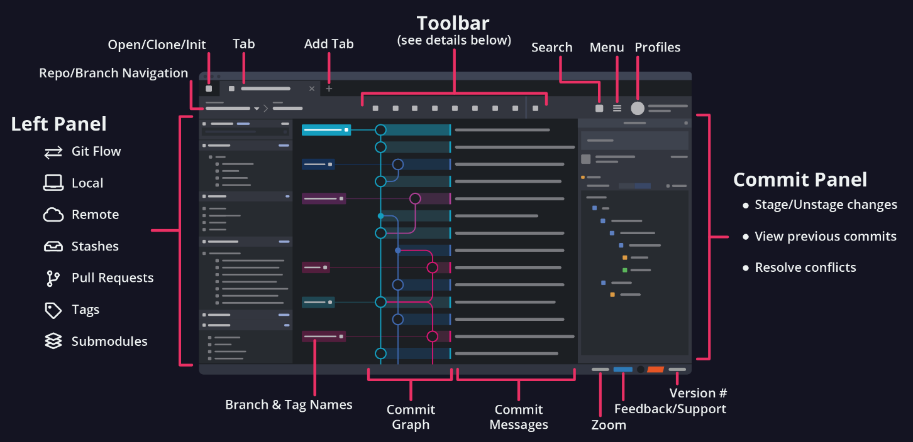

> "The whole idea behind any version control system is to store “safe” copies of a project so that you never have to worry about irreparably breaking your code base." - Bitbucket.org

***

*The notes below are modified from the excellent [Version Control with Git](http://swcarpentry.github.io/git-novice/) freely available on the Software Carpentry website.*

***

# Version Control

  

**Version control** systems start with a base version of the document and then record changes you make each step of the way. You can think of it as a recording of your progress: you can rewind to start at the base document and playback each change you made, eventually arriving at your more recent version.

  

Once you think of changes as separate from the document itself, you can then think about “playing back” different sets of changes on the base document, ultimately resulting in **different versions** of that document. For example, two users can make independent sets of changes on the same document:

  

Unless multiple users make changes to the same section of the document - a conflict - you can incorporate two sets of changes into the same base document.

  

A version control system is a tool that keeps track of these changes for us, effectively creating different versions of our files. It allows us to decide which changes will be made to the next version (each record of these changes is called a **commit**), and keeps useful metadata about them. The complete history of commits for a particular project and their metadata make up a **repository**. Repositories can be kept in sync across different computers, facilitating collaboration among different people.

***

# Git

## What is Git?

Git is the **most commonly used** version control system in the world today and is considered the modern standard for software development. 

Git thinks of its data more like a series of snapshots of a filesystem. With Git, every time you *commit*, or save the *state* of your project, Git basically takes a picture of what all your files look like at that moment and stores a reference to that snapshot. To be efficient, if files have not changed, Git doesn’t store the file again, just a link to the previous identical file it has already stored. **Git thinks about its data more like a stream of snapshots.** This makes Git more like a mini **filesystem** with some incredibly powerful tools built on top of it. (Source: [Getting Started - What is Git?](https://www.git-scm.com/book/en/v2/Getting-Started-What-is-Git%3F))

  

Git tracks the changes you make to files, so you have a record of what has been done, and you can revert to specific versions should you ever need to. Git also makes collaboration easier, allowing changes by multiple people to all be merged into one source. So regardless of whether you write code that only you will see, or work as part of a team, Git will be useful for you. (Source: [What Is Git & Why Should You Use It?](https://www.nobledesktop.com/blog/what-is-git-and-why-should-you-use-it#:~:text=Git%20is%20the%20most%20commonly%20used%20version%20control,people%20to%20all%20be%20merged%20into%20one%20source.))

Git is a software that runs **locally**. Your files and their history are stored on your computer. You can also use online hosts/platforms (such as [GitHub](https://github.com), [Gitlab](https://about.gitlab.com), or [Bitbucket](https://bitbucket.org)) to store a copy of the files and their revision history. Having a centrally located place where you can upload your changes, and download changes from others, enable you to collaborate more easily with other developers. Git can automatically merge the changes, so two people can even work on different parts of the same file and later merge those changes without losing each other’s work.

## Why is Git Useful?

* A backup of your files (repository) (Source: [Version Control with Git](https://research.computing.yale.edu/sites/default/files/files/Version%20Control%20with%20Git(1).pdf))
* Cleaner file system - no more “code, codev2, codev3_test, codev3_test1” directories
* Record of your edits thought process
* Check for bugs in inconsistent results
* Unlimited and powerful “undo”
* Collaboration

## The Three States

Git has three main states that your files can reside in: **modified**, **staged**, and **committed**: 

* Modified means that you have changed the file but have not committed it to your database yet.

* Staged means that you have marked a modified file in its current version to go into your next commit snapshot.

* Committed means that the data is safely stored in your local database.

This leads us to the three main sections of a Git project: the working directory, the staging area, and the Git directory.

  

The working directory is a local copy of one version of the project. These files are *pulled* out of the compressed database in the Git directory and placed on disk for you to use or modify.

The staging area is a file, generally contained in your Git directory, that stores information about what will go into your next commit. 

The Git directory is where Git stores the metadata and object database for your project. This is the most important part of Git, and it is what is copied when you clone a repository from another computer.

## Basic Git Workflow 

The basic Git workflow goes something like this:

* You modify files in your working directory.

* You selectively stage just those changes you want to be part of your next commit, which adds only those changes to the staging area.

* You do a commit, which takes the files as they are in the staging area and stores that snapshot permanently to your Git directory.

## Glossary

**Commit**:  
To record the current state of a set of files (a changeset) in a version control repository. As a noun, the result of committing, i.e. a recorded changeset in a repository. If a commit contains changes to multiple files, all of the changes are recorded together.
      
**Master**:  
The default development branch. Whenever you create a Git repository, a branch named "master" is created, and becomes the active branch. In most cases, this contains the local development, though that is purely by convention and is not required.

**Merge**:  
(a repository): To reconcile two sets of changes to a repository.

**Origin**:  
The default upstream repository. Most projects have at least one upstream project which they track. By default, origin is used for that purpose.

**Pull**:  
Pulling a branch means to fetch it and merge it. 
    
**Push**:  
Pushing a branch means to get the branch’s head from a remote repository, find out if it is an ancestor to the branch’s local head ref, and in that case, putting all objects, which are reachable from the local head ref, and which are missing from the remote repository, into the remote object database, and updating the remote head ref. If the remote head is not an ancestor to the local head, the push fails.

**Remote**:  
(of a repository) A version control repository connected to another, in such way that both can be kept in sync exchanging commits.

**Repository**:  
A storage area where a version control system stores the full history of commits of a project and information about who changed what, when.
    
**Resolve**:  
To eliminate the conflicts between two or more incompatible changes to a file or set of files being managed by a version control system.    

**Timestamp**:  
A record of when a particular event occurred.

**Version control**:  
A tool for managing changes to a set of files. Each set of changes creates a new commit of the files; the version control system allows users to recover old commits reliably, and helps manage conflicting changes made by different users.

See more about Git Glossary at the [Git website](https://git-scm.com/docs/gitglossary). 
    
***

# Using GitKraken

Follow the instructor to do the following:

## Interface

Navigate yourself with the Interface.

## Initialize a new repository

`New Tab` -> `Start a local repo` -> `Init` -> `Local Only`

## Staging a change

* Modify the `README` file
* Staging adds selected file contents to the index, which is like flagging your work as good to go. To start, select the `//WIP` node to see all your files on the Commit Panel. `WIP` stands for work in progress.
* Once the `//WIP` node is selected, a `Stage File` tab will appear when you hover over a file in the Commit Panel.
* You may also click on a file for review in the diff or click the `Stage all changes`. 

## Unstaging
Unstage files by selecting a staged file and hitting the button that appears.

## Commit a change

After Staging the change, write a short summary of the change. [Good commit messages](https://chris.beams.io/posts/git-commit/) start with a brief (<50 characters) statement about the changes made in the commit. Generally, the message should complete the sentence “If applied, this commit will”. If you want to go into more detail, add a blank line between the summary line and your additional notes. Use this additional space to explain why you made changes and/or what their impact will be.

Then click `Commit changes to 1 file`. Immediately, you will see a summary of the commit.

The above steps can be viewed as:

## Add a file to the repository

Now add a new file into the repository. Stage this change, and commit it.

## Check the Activity Logs

Pop open the hood of your project and check out the `Activity Logs` located in the footer toolbar of GitKraken. `Activity Logs` provide real-time feedback of application and repository-level interactions that occurred in GitKraken. `Activity Logs` files are plain text in a standard log file format. Each line displays the time of action, action feedback, and performance data measured in milliseconds.

## Integration with GitHub

Now your repository is merely local. We need to integrate it with GitHub to make a `remote` repository.

* Click `Push`, you will get a message `There is no remote to push to, would you like to add one?`. Select `Yes`.
* Provide your GitHub information and integrate it.
* Finally, click `Create remote and push local refs`

## Browse GitHub

Log in GitHub, you should see a new repository which is excatlly the same as your local one. 

## Upload a new file via GitHub

Upload a new file via GitHub, and commit the change. Check what happens with your GitKraken.

## Pull a repository
In GitKraken, you will find the `remote` is ahead of the local repository. Click `Pull` to get the latest changes. Pull the `remote` to `main`. Check your local folder.

## Delete your local repository

Now close GitKraken, and delete the local repository. What happens to the `remote`?

## Clone a remote repository

`New Tab` -> `Clone a repo` -> `Clone`. 
Provide the URL of the `remote`, then click `Clone the repo!`. Or select the remote repository under the `Github.com` tab, then click `Clone the repo!`. By doing so, your repository will go back soon.

## Other important usages

For now, we only cover the basic usage of Git. In fact, there are other important usages of Git, like `branch`, `merge`, `conflict`, and `pull request`. Go to [GitKraken Guide](https://support.gitkraken.com/start-here/guide/) for more.

Git is a also powerful command-line tool. Check [Version Control with Git](http://swcarpentry.github.io/git-novice/) for more.

***

# In-class exercises

## Exercise #1

Imagine you drafted an excellent paragraph for a paper you are writing, but later ruin it. How would you retrieve the excellent version of your conclusion? Is it even possible?

## Exercise #2

* Create a local repository `NewRepo`

* Write some sentences in the `README`, describing the purpose of this repository.

* Add a text file to this folder, stage and then commit your change.

* Modify the above text file by adding and deleting a few lines, stage and then commit your change.

* Add another file (e.g., in `.csv` or `.pdf` format) to the folder, stage and then commit your change.

* Add *two* files at the same time to the folder, stage and then commit your changes.

* Now `push` the local repository to GitHub. Check your *filesystem* on GitHub.

* Upload another file via GitHub, commit the change.

* Edit your text file online by clicking the file, then `Edit this file`, commit the change.

* Now `pull` the `remote` repository to update your local repository.

* Take a look at the Activity Logs. Do the logs record your commands?

* Now close GitKraken, and delete your local folder.

* Reopen GitKraken, `clone` the `NewRepo` repository from GitHub.

## Exercise #3

* Create a local repository `ESE5023_Assignments_XXX`, where `XXX` is your SUSTech ID.

* Push it to GitHub as a `remote` repository. This is the place you are going to turn in your assignments, *e.g*., `PS1/PS1_1.py`, `PS1/PS1_2.py`, `PS3/PS3_3.py`,...

* Go to GitHub, click `ESE5023_Assignments_XXX` repository, then `Settings`. Under the `Collaborators` sub-page, then in `Manage access` box, click `Add people`, add invite `LIXicheng00` and then `chen-yuy` as collaborators. By doing so, your TAs will be able to get access to your GitHub `ESE5023_Assignments_XXX` repository, and they will grade your assignments and provide necessary feedback in the future. 

***

# Further reading

* [Version Control with Git](http://swcarpentry.github.io/git-novice/)
* [Git Basics](https://git-scm.com/about)
* [Learn Git with GitKraken, with videos](https://www.gitkraken.com/resources/learn-git)
* [GitKraken Guide](https://support.gitkraken.com/start-here/guide/)
