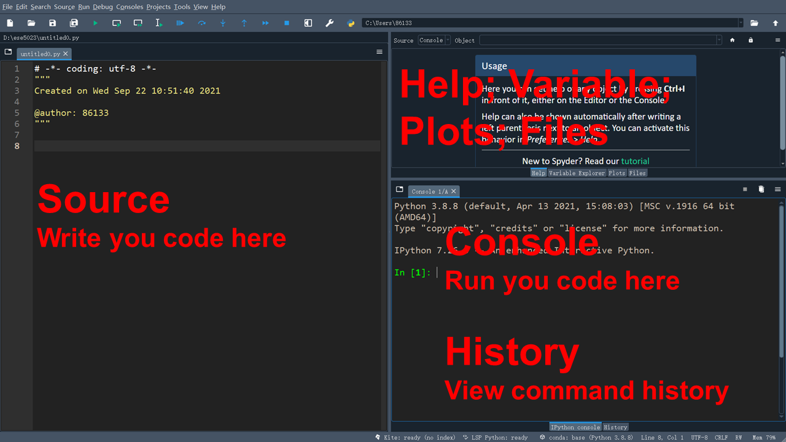

> "I was what they call 'skinny fat' - a body that resembled a python after swallowing a goat." - A. J. Jacobs

***

# What is `Python`? 

`Python`, one of the most popular programming languages in the world, has created everything from Netflix’s recommendation algorithm to the software that controls self-driving cars. `Python` is a general-purpose language, which means it’s designed to be used in a range of applications, including **data science**, **software and web development**, **automation**, and generally **getting stuff done**.

`Python` is a computer programming language often used to build websites and software, automate tasks, and conduct data analysis. `Python` is a **general-purpose language**, meaning it can be used to create a variety of different programs and isn’t specialized for any specific problems. This versatility, along with its beginner-friendliness, has made it one of the most-used programming languages today. A survey found that it was the most popular programming language among developers in 2020.


[Figure source](https://www.reddit.com/r/ColorBlind/comments/ftir2q/a_graph_i_found_on_stack_overflow/)

***

# Why `Python`? 

`Python` is popular for a number of reasons. Here’s a deeper look at what makes it so versatile and easy to use for coders.

+ It has a **simple syntax** that mimics natural language, so it’s easier to read and understand. This makes it quicker to build projects, and faster to improve on them.

+ It’s **versatile**. `Python` can be used for many different tasks, from web development to machine learning.

+ It’s **beginner-friendly**, making it popular for entry-level coders.

+ It’s **open source**, which means it’s free to use and distribute, even for commercial purposes.

+ `Python`’s **archive of modules and libraries**, bundles of code that third-party users have created to expand `Python`’s capabilities, is vast and growing.

+ `Python` has **a large and active community** that contributes to `Python`’s pool of modules and libraries, and acts as a helpful resource for other programmers. The vast support community means that if coders run into a stumbling block, finding a solution is relatively easy; somebody is bound to have run into the same problem before.


[Figure source](https://9gag.com/gag/a9AgB0D)

***

# First look at `Spyder`

Follow [instructions](https://zhu-group.github.io/ese5023/Resource.html#Python) to install `Spyder`.

The `Spyder` IDE (Integrated Development Environment) is a simple and beginner-friendly integrated development environment for `Python`. It allows you to write, run, and debug your `Python` code.



***

# Introduction to `Python`

## The flow

By default, `Python` runs the *script* line by line. For example, if you run the following lines, a triangle would show up in your Console.

```{python, eval=F}
# Print a triangle
print("    /|")
print("   / |")
print("  /  |")
print(" /   |")
print("______")
```

Always think about clarifying your intentions, as others may later read your code. Here we call such intentions as "comments". Anything that follows after the hash symbol `#` is ignored by `Python` when it executes code.

We can write a few lines with meaningful information:

```{python, eval=F}
# Print a few lines with meaningful information
print("Once there is a guy Lei, ")
print("he is 36 years old.")
print("He likes the name Lei,")
print("but does not like being 36.")
```

The output in your Console will be in the same order.

## Variables

Suppose you want to change the name `Lei` and age `36` in the previous chunk of code, something like:

```{python, eval=F}
# Print a few lines with meaningful information
print("Once there is a guy Peng, ")
print("he is 22 years old.")
print("He likes the name Peng,")
print("but does not like being 22.")
```

It would be very handy if we could create **variables** to contain those pieces of information, and later use those variables directly. 

```{python, eval=F}
# Create variables
name = "Lei"
age  = "18"

# Use variables
print("Once there is a guy " + name + ", ")
print("he is " + age + " years old.")
print("He likes the name " + name + ", ")
print("but does not like being " + age + ".")
```

Here you see we use `=` to assign the variables. A *string* is defined with the `""`, and we use `+` to combine two strings.

Now change the `name` and `age` to feel the power of variables:

```{python, eval=F}
# Create variables
name = "Superman"
age  = "180"

# Use variables
print("Once there is a guy " + name + ", ")
print("he is " + age + " years old.")
print("He likes the name " + name + ", ")
print("but does not like being " + age + ".")
```

Or use `\n` inside a string as `ENTER` to start a new line:

```{python, eval=F}
# Create a variable
school = "School of Environment"

# Use +
print(school + " is Cool!")

# Use \n
print("School of Environment \nis cool!")

```

**`Python` variables are case-sensitive.**

```{python, eval=F}
# Create variables
Age = "200"
age = "180"

print(Age)
print(age)
```

## Working with strings

`Python` provides many built-in *functions* to handle strings, here are some commonly-used ones:

```{python, eval=F}
# Create a variable
school = "School of Environment"

# Change all characters into lower case
print(school.lower())

# Change all characters into upper case
print(school.upper())

# Are all characters in upper case? 
print(school.isupper())

# Get the length of the string
print(len(school))
```

Here we use `.` to call a function, and then apply the function to `school`. You may also use several functions one after another:

```{python, eval=F}
# Call upper() first, then pass the output to isupper()
print(school.upper().isupper())
```

If you want to get a specific character, use *index*. **Remember, index in `Python` starts from `0`**.

```{python, eval=F}
# Print the 1st character
print(school[0])

# Print the 2nd character
print(school[1])

# Print a substring 
print(school[5:10])
```

Use `index()` to return the index of a string, or `replace()` to replace a string with something else.

```{python, eval=F}

# Use index()
# School of Environment
# 012345678901234567890
print(school.index("E"))

# Return the 1st match case
print(school.index("o"))

# Return the index of the substring
print(school.index("Env"))

# Try this, can you find z?
print(school.index("z"))

# Use replace()
print(school)
print(school.replace("Environment","Chemistry"))
print(school)
```

## Working with numbers

When using `Python` as a calculator, the order of operations is the same as you would have learned back in school. From highest to lowest precedence:

* Parentheses: `(`, `)`
* Exponents:  `**`
* Multiply: `*`
* Divide: `/`
* Add: `+`
* Subtract: `-`

```{python, eval=F}
# Get the square root of 100
100 ** 0.5
```

Really small or large numbers get a *scientific notation*:
```{python, eval=F}
2 / 100000
```
You can write numbers in scientific notation too:
```{python, eval=F}
5e+5 * 1e+5
5.2E+5 + 4.8E+6
```

To convert number to string, use `str()`

```{python, eval=F}
# Convert number to string
age = 18
print(str(age))
print(str(age) + " is my age")

# This would lead to an error
print(age + " is my age")
```

## Mathematical functions

`Python` has many built-in mathematical functions. To call a function, we can type its name, followed by open and closing parentheses `()`. Anything we type inside the parentheses is called the function’s *arguments*:

```{python, eval=F}
# Get the mod
print(10 % 3)

# Get the absolute value
abs(-5)

# Get the power
pow(10, 2)

# Max and min
max(4, 6)
min(4, 6)

# Round
round(3.2)
round(3.7)

# Round with 1 digit
round(3.71,1)
```

You can find more mathematical functions in the `math` library. To import those functions, we type:

```{python, eval=F}
from math import *
floor(3.7)
ceil(3.7)
sqrt(36)
```

`from math import *` means we import all functions from the `math` library.

Find more functions and how to use them at [Mathematical functions](https://docs.python.org/3.8/library/math.html).

## User inputs 

Use `input()` to ask for inputs from the user:

```{python, eval=F}
# Ask for inputs from a user
name = input("Please enter your name: ")
age  = input("Please enter your age: ")

print("Hello " + name + "! You are " + age)
```

## Comparing things

We can also do comparisons:

```{python, eval=F}
# Equality (note two equals signs, read as "is equal to")
1 == 1
# Inequality (read as "is not equal to")
3 != 2  
# Less than
100 < 101  
# Less than or equal to
1e3 <= 2e3
# Greater than
1/3 > 1/5
# Greater than or equal to
-100 > -200
# Use not() function
not(1 == 1)
```

Such `True` or `False` is called `bool` type. So far, we have covered `int`, `float`, `string`, and `bool`. You can always use `type()` function to determine the type of a variable.

```{python, eval=F}
# Use type() function
type(1)
type(1.0)
type("1")
type(1 == 1)
```

## List

Python has a great built-in list type named `list`. `List` literals are written within square brackets `[ ]`. Lists work similarly to strings - use the `len()` function and square brackets `[ ]` to access data, with the first element at index `0`.

```{python, eval=F}
# Make a list
my_list = ["Xiaohua", "Xiaoming", "Xiaoli", 9, 10.1]

# Print the list
print(my_list)

# Show the 1st element
print(my_list[0])

# Show the last element
print(my_list[-1])

# Includes element at index 2 and 3,
# excludes element at index 4
print(my_list[2:4])

# Show the 2nd element and afterward
print(my_list[1:])
```

Some common functions to handel lists:

```{python, eval=F}
# Make a list
firends = ["Xiaohua", "Xiaoming", "Xiaoli", "Xiaoyan", "Xiaoguang", "Xiaoping"]

# Make another list
ages    = [20, 31, 18, 29, 45, 15]

# Extend the list by appending all the items from the iterable
firends.extend(ages)
print(firends)

# Add an item to the end of the list
firends.append("99")
print(firends)

# Return index in the list of the first item whose value is equal to x
print(firends.index("Xiaoli"))
print(firends.index("Xiaoniu"))

# Insert an item at a given position
firends.insert(0,"Xiaoyong")
print(firends)

# Remove the first item from the list whose value is equal to x
firends.remove("Xiaoli")
print(firends)

# Remove all items from the list
firends.clear()
print(firends)

#------------------------------
# Make a new list
firends = ["Xiaohua", "Xiaoming", "Xiaoli", "Xiaoyan", "Xiaoguang", "Xiaoping", "Xiaoming"]

# Return the number of times x appears in the list
firends.count("Xiaoming")

# Sort the items of the list
firends.sort()
print(firends)

ages.sort()
print(ages)

# Reverse the elements of the list 
firends.reverse()
print(firends)

ages.reverse()
print(ages)

# Return a shallow copy of the list
firends2 = firends.copy()
print(firends2)

```

For more functions, please refer to [Python Data Structures - More on List](https://docs.python.org/3/tutorial/datastructures.html#more-on-lists).

## Tuple

A `tuple` is a collection of objects which are ordered and **immutable**. Tuples are sequences, just like lists. The differences between tuples and lists are, the tuples **cannot be changed** unlike lists; and tuples use parentheses `()`, whereas lists use square brackets `[]`.

```{python, eval=F}
# Define a tuple
coordinates = (25.6, 119.8)

# Print the tuple
print(coordinates)

# Print the 2nd element
print(coordinates[1])

# Can you change it?
coordinates[1] = 120.7

# A more complex tuple
coordinates = [(25.6, 119.8), (22.9, 118.8), (21.7, 116.2)]

# Print the tuple
print(coordinates)

# Print the 2nd element
print(coordinates[1])

# What does this print?
print(coordinates[1][1])
```

For more functions, please refer to [Python Data Structures - Tuples and Sequences](https://docs.python.org/3/tutorial/datastructures.html#tuples-and-sequences).

## Function

A function is a block of organized, reusable code that is used to perform a single, related action. Functions provide better modularity for your application and a high degree of code reusing.

As you already know, `Python` gives you many built-in functions like `print()`, etc., but you can also create your own functions. These functions are called user-defined functions.

Let's define a simple function to say hi:

```{python, eval=F}
# Define a function to say hi
def say_hi():
    print("Hi there!")
```

Function blocks begin with the keyword `def`, followed by the function name and parentheses `( )`. The code block within every function starts with a colon `:` and is **indented** - things not indented are not part of the function.

Call the function by:

```{python, eval=F}
# Call the function
say_hi()
```

We can pass a variable, aka `parameter`, in the function like:

```{python, eval=F}
# Define a function with one parameter
def say_hi(name):
    print("Hi " + name + "!")

say_hi("ESE5023ers")
```

You can pass more than one parameter:

```{python, eval=F}
# Define a function with two parameters
def say_hi(name, age):
    print("Hi " + name + ", you are " + age)

say_hi("Xiaoming", "20")
```

## Return values from a function

The statement `return` exits a function, optionally passing back an expression to the caller. A return statement with no arguments is the same as return `None`.

```{python, eval=F}
# Define a function to return the square of a number
def get_square(num):
    return num*num

get_square(10)
```

Or you can assign the return value into a variable:

```{python, eval=F}
result = get_square(50)
print(result)
```

## Conditional statements 

Often when we’re coding, we want to control the flow of our actions. This can be done by setting actions to occur only if a condition or a set of conditions are met. 

There are several ways you can control flow in `Python`. For conditional statements, the most commonly used approaches are the `if` and `else` constructs.

Given today's AQI (Air Quality Index) value, suppose we want to write a piece of code to check whether the Air Quality is excellent (AQI <= `50`) or not.

```{python, eval=F}
AQI = 59
# If this condition is TRUE
if (AQI <= 50):
  # Do the following
  print("Air Quality is Excellent")
```

The print statement does not appear in the **Console** because `AQI` is larger than `50`. To print a different message for numbers larger than `50`, we can add an `else` statement.

```{python, eval=F}

# If this condition is TRUE
if (AQI <= 50):
  # Do the following
  print("Air Quality is Excellent")
# If this condition is FALSE  
else:
  print("Air Quality is NOT Excellent")
```

You can also test multiple conditions by using `elif` (means else if).

```{python, eval=F}
# Now use else if  
if (AQI <= 50):
  # Do the following line
  print("Air Quality is Excellent")
elif (AQI <= 100):
  # Do the following line
  print("Air Quality is GOOD")
else:
  # Do the following line
  print("Air Pollution!")
```

Change `AQI` to `40`, `80`, and `120`, check the output.

**Important**: when `Python` evaluates the condition inside `if` statements, it is looking for a logical element (`bool`), *i.e.*, `TRUE` or `FALSE`. 

```{python, eval=F}
AQI1 = 69
AQI2 = 140

if (AQI1 <= 100 or AQI2 <= 100):
  print("There is at least 1 site with a GOOD air quality")

if (AQI1 <= 100 and AQI2 <= 100):
  print("Both sites have GOOD air quality")
  
```

Change `AQI2` to `40`, `80`, and `120`, check the output. 


## Seeking Help

**Reading Help files**

`Python`, and every library, provide help files for functions. The general syntax to search for help on any function, "function_name", from a specific function that is in a library imported into your namespace (your interactive `Python` session): 

`help(function_name)`

This will load up a help page.

**When your code doesn’t work: seeking help from your peers**

If you’re having trouble using a function, 9 times out of 10, the answers you are seeking have **already been answered** on [Stack Overflow](https://stackoverflow.com/). You can search using the `[python-3.x]` tag. Finally, you will always find Google is your good friend.

***

# In-class exercises

## Exercise #1

* Create a folder named `ESE5023` 
  + Windows: In `C:\` or `D:\` disk
  + macOS: In `/home/`
* Change `Spyder` `Working directory` to the above folder.

## Exercise #2

```{python eval=FALSE}
X1  = 50
X2  = 120
X3  = X2 * 2.0
X4  = X1 - 20
X5  = X1 > X2
```
What will be the value of each variable after each statement in the program? 

* Now type the above lines in **Console**, check your results.  
* Write a command to compare `X3` to `X4`. Which one is larger?
* Clean up your variables by deleting the `X1`, `X2`, and `X3`. 

## Exercise #3

Build a basic calculator:

+ First, it asks a user to input two numbers.

+ Then it prints the addition of the two variables.

[Hint: you may find `float()` function useful to convert a string into a number]


## Exercise #4

* Create a function `f2c` that returns temperatures in degrees Celsius (*C*) with Fahrenheit temperature (*F*) as input parameter, based on the following equation:
$$C = (F - 32) * 5/9$$

* Check output with *F*=32 and *F*=100.

* Can you create its inverse function `c2f` to convert temperatures in degrees Celsius  (*C*) to Fahrenheit (*F*) ?

***

# Further reading

* [Python For Data Science Cheatsheet Python Basics](https://s3.amazonaws.com/assets.datacamp.com/blog_assets/PythonForDataScience.pdf)
* [Python For Beginners](https://www.python.org/about/gettingstarted/)
* [Official The Python Tutorial](https://docs.python.org/3.8/tutorial/index.html)
* [Google's Python Class](https://developers.google.com/edu/python) (May need a vpn)
* [Plotting and Programming in Python](http://swcarpentry.github.io/python-novice-gapminder/index.html)
* [Programming with Python](https://swcarpentry.github.io/python-novice-inflammation/)
