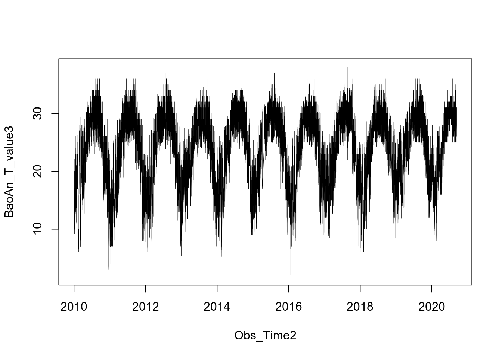

> "I will, in fact, claim that the difference between a bad programmer and a good one is whether he considers his code or his data structures more important. Bad programmers worry about the code. Bad programmers worry about the code. Good programmers worry about data structures and their relationships." - Linus Torvalds

# Keeling Curve
  


[Charles David Keeling](https://scrippsco2.ucsd.edu/history_legacy/charles_david_keeling_biography.html) directed a program to measure the concentrations of CO~2~ in the atmosphere that continued without interruption from the late 1950s through the present. This program, operated out of [Scripps Institution of Oceanography](https://scripps.ucsd.edu), is responsible for the Mauna Loa record, which is almost certainly the ***best-known icon*** illustrating the impact of humanity on the planet as a whole. [^1] 

We will use [monthly CO~2~ data](https://www.esrl.noaa.gov/gmd/ccgg/trends/data.html) measured from Mauna Loa in this section. 

[^1]: [Keeling Curve Lessons](https://scrippsco2.ucsd.edu/history_legacy/keeling_curve_lessons.html)

***

# Loading .csv file

To begin with, download the `co2_mm_mlo.csv` file from [here](https://zhu-group.github.io/ese5023/download/co2_mm_mlo.csv). Save the file to your `working directory`. Take a look at the file, where the column `co2` means monthly average CO~2~ in the unit of ppm (part per million, 10^-6^), `quality` column is the quality flag of the observation, `0` means the data point does not meet the quality control so that should be discarded, `1` means the data point is usable.

We can load this file via the following:
```{r}
Keeling_Data <- read.csv(file = "co2_mm_mlo.csv", header = T)
```
Now the file is loaded into the dataset `Keeling_Data`. Here we use the *option* `header = T` so that the first line of `co2_mm_mlo.csv` is loaded as names of the variables. You can try to turn this off by setting `header = F`, and check what happens.

Check the names of columns:
```{r}
colnames(Keeling_Data)
```

If column names are not specified, *e.g.*, using `headers = FALSE` in a `read.csv()` function, R assigns default names `V1`, `V2`, ..., `Vn`.

Check the head (first 6 lines) of the dataset using `head()` function
```{r}
head(Keeling_Data)
```
Or the end of (last 6 lines) with `tail()`:
```{r}
tail(Keeling_Data)
```

Or specify how many lines you want to check:
```{r}
head(Keeling_Data,3)
tail(Keeling_Data,4)
```

The `read.table()` function is used for reading in **tabular data** stored in a text file where the columns of data are separated by punctuation characters such as `.csv` files (csv = comma-separated values). `Tabs` and `commas` are the most common punctuation characters used to separate or delimit data points in `.csv` files. For convenience R provides 2 other versions of `read.table()`. These are: `read.csv()` for files where the data are separated with `commas` and `read.delim()` for files where the data are separated with `tabs`. Of these three functions, `read.csv()` is the most commonly used. If needed it is possible to override the default delimiting punctuation marks for both `read.csv()` and `read.delim()`.

```{r}
head(Keeling_Data,3)
tail(Keeling_Data,4)
```

We can begin exploring our dataset right away, pulling out columns by specifying them using the `$` operator:

```{r}
Keeling_Data$co2
```

Let's do a few simple statistical checks with `Keeling_Data$co2`:
```{r}
# Min
min(Keeling_Data$co2)
# Max
max(Keeling_Data$co2)
# Mean
mean(Keeling_Data$co2)
# Plot the histogram
hist(Keeling_Data$co2)
# Show quantiles
summary(Keeling_Data$co2)
```
You will find there are some `-99.99` values, thoese are actually *missing values*. We will get back to this later.

You can use `[]` to extract elements of a vector by specifying their corresponding *index*.  

**Important:** Index in R starts from `1`, not `0`. For example:
```{r}
Keeling_Data$co2[1:10]
Keeling_Data$year[200:210]
Keeling_Data$co2[0]
```
We can mimic the Keeling Curve using `plot()` function
```{r}
plot(Keeling_Data$decimal_date, Keeling_Data$co2)
```

It's ugly as there are a few data points with a value of `-99.99` (quality=`0`). We can polish the figure as:

```{r}
plot(Keeling_Data$decimal_date, Keeling_Data$co2, ylim=c(300,420), type="l")
```

In fact, we should never use data points with a value of `-99.99` (quality=`0`). One good way to do so is to set those values to `NA` (Not Available) or *Missing Values*.

```{r}
Year     <- Keeling_Data$decimal_date
CO2_ppm  <- Keeling_Data$co2 
CO2_ppm[which(CO2_ppm == -99.99)]  <- NA
plot(Year, CO2_ppm, type="l")
```

Here we use `which()` function to find  values equal to `-99.99`. We use `type="l"` to plot a line, you can set `type="p"` to plot points, and `type="o"` to plot points + line.

**Important:** Always use the `na.rm=T` opintion to handle vectors containing `NA` values.

```{r}
mean(CO2_ppm)
mean(CO2_ppm, na.rm=T)
```

***

*The notes below are modified from the excellent [online R tutorial](http://swcarpentry.github.io/r-novice-gapminder/) freely available on the Software Carpentry website.*

***

# Data Types

Let's try:
```{r}
Keeling_Data$co2[1:10] * 1e3
```
By doing so, we convert CO~2~ in a unit of ppb (part per billion, 10^-9^).  Then how about:

```{r, eval=FALSE}
Keeling_Data$month[1:10] + Keeling_Data$co2[1:10]
```
The above line won't work as `Keeling_Data$month` and `Keeling_Data$co2` has different *data types*.

In R, there are 5 main types: `double`, `integer`, `complex`, `logical`, and `character`. We can ask what type of data something is using the `typeof()` function:
```{r}
typeof(Keeling_Data$co2)
typeof(Keeling_Data$month)
typeof(Keeling_Data$quality)

x <- 1 <= 2
typeof(x)
```

By default, R uses float numbers. Use a `L` suffix to force the number to be an integer: 
```{r}
typeof(1)
typeof(1L)
```

We don't use `complex` very often; it can be defined as `a + bi`, where `a` and `b` are numbers:
```{r}
typeof(1+1i)
```

No matter how complicated our analyses become, all data in R is interpreted as one of these basic data types. 

# Data structure 

When R reads the `co2_mm_mlo.csv` file, it loads the table  into something called a `data.frame`, and named it as `Keeling_Data`. A `data.frame` is a structure that R knows how to build out of the basic data types.

We can check that it is a `data.frame` by calling the `class()` function on it:
```{r}
class(Keeling_Data)
```

In order to use our data in R, we need to understand what the basic data structures are and how they behave.

## Vector and type coercion

To better understand data structure, let’s meet the first data structure: the `vector`.
```{r}
vector_1 <- vector(length = 3)
vector_1
```

A vector in R is essentially **an ordered list of things**, with the special condition that **everything in the vector must be the same basic data type**. If you don’t choose the datatype, it’ll default to `logical`; or, you can declare an empty vector of whatever type you like.
```{r}
vector_2 <- vector(mode='character', length=3)
vector_2
```

You can check if something is a vector using the `str()` function:
```{r}
str(vector_2)
```

The output from this command indicates the basic data type found in this vector - in this case `chr`, or character; an indication of the number of things in the vector - actually, the indexes of the vector, in this case `[1:3]`; and a few examples of what’s actually in the vector - in this case empty character strings. If we similarly do:
```{r}
str(Keeling_Data$co2)
```
we see that `Keeling_Data$co2` is a vector, too - the columns of data we load into R data.frames are all elements in this vector. This is why R forces everything in a column to be the **same basic data type**.

You can also make vectors with explicit contents with the combine function `c()`:
```{r}
vector_3 <- c(1,2,3)
vector_3
```
Given what we’ve learned so far, what do you think the following will produce?
```{r}
vector_4 <- c(1,2,3,"4")
vector_4
```
This is something called *type coercion*, and it is the source of many surprises and the reason why we need to be aware of the basic data types and how R will interpret them. When R encounters a mix of types (here `double` and `character`) to be combined into a single vector, it will **force them all to be the same type**. Consider:
```{r}
vector_5 <- c("a", TRUE)
vector_5
```

```{r}
vector_6 <- c(0, TRUE)
vector_6
```

The coercion rules go:  
`logical` -> `integer` -> `numeric` -> `complex` -> `character`   
where -> can be read as being *transformed into*. You can try to force coercion against this flow using the `as.` functions:

```{r}
vector_7 <- c('0','2','4')
vector_7
vector_8 <- as.numeric(vector_7)
vector_8
vector_9 <- as.logical(vector_8)
vector_9
```

As you can see, some surprising things can happen when R forces one basic data type into another!

**Rememebr:** If your data doesn’t look like what you thought it was going to look like, type coercion may well be to blame; make sure everything is the **same type** in your vectors and your columns of `data.frames`, or you will get nasty surprises!

Coercion can also be very useful. For example, in our `Keeling_Data` data `quality` is `numeric`, but we know that the 1s and 0s actually represent `TRUE` and `FALSE` (a common way of representing them). We should use the `logical` datatype here, which has two states: TRUE or FALSE, which is exactly what our data represents. We can ‘coerce’ this column to be `logical` by using the `as.logical()` function:

```{r}
# Old data
Keeling_Data$quality[1:10]
Keeling_Data$quality <- as.logical(Keeling_Data$quality)
# New data
Keeling_Data$quality[1:10]
```

Finally, you can use the `length()` function to check how many elements in a vector:
```{r}
length(Keeling_Data$quality)
```
And use `names()` to give names to elements in your vector:
```{r}
x <- 1:26
x <- x * 2
names(x) <- LETTERS
x
```
Here `LETTERS` is a built in vector from `A` to `Z`.

## Factor

Another important data structure is called a *factor*. Factors usually look like character data but are typically used to represent categorical information. 

Let’s turn `Keeling_Data$month` vector into a factor like so:
```{r}
str(Keeling_Data$month)
Keeling_Data$month <- factor(Keeling_Data$month)
class(Keeling_Data$month)
str(Keeling_Data$month)
```

Now R has noticed that there are `12` possible categories in our data - but it also did something surprising; instead of printing out the strings we gave it, we got a bunch of numbers instead. R has replaced our human-readable categories with numbered indices under the hood. This is necessary as many statistical calculations utilize such numerical representations for categorical data:
```{r}
typeof(Keeling_Data$month)
```

## List

Another data structure you’ll use is the `list`. A list is simpler in some ways than the other types because you can put anything you want in it:
```{r}
list_1 <- list(1, "a", TRUE, 1+4i)
list_1
list_2 <- list(title = "Numbers", numbers = 1:10, data = TRUE )
list_2
```

We can now understand something a bit surprising in our `data.frame`; what happens if we run:
```{r}
typeof(Keeling_Data)
```

We see that `data.frames` look like `lists` - this is because a `data.frame` is really a list of vectors and factors, as they have to be - in order to hold those columns that are a mix of vectors and factors, the `data.frame` needs something a bit more flexible than a vector to put all the columns together into a familiar table. In other words, a `data.frame` is a special `list` in which all the vectors **must have the same length**.

In our `Keeling_Data` example, we have an integer, a double, and a logical variable. As we have seen already, each column of `data.frame` is a vector. 
```{r}
Keeling_Data[,1]
typeof(Keeling_Data[,1])
Keeling_Data[,2]
typeof(Keeling_Data[,2])
str(Keeling_Data[,2])
```

Each row is an observation of different variables, itself a `data.frame`, and thus can be composed of elements of different types.
```{r}
Keeling_Data[1,]
typeof(Keeling_Data[1,])
str(Keeling_Data[1,])
```

## Matrix and array

A `matrix` is a **two-dimensional** `array` and they are commonly used as part of the mathematical machinery of statistics. We can declare a matrix full of zeros using the `matrix()` function:
```{r}
matrix_1 <- matrix(0, ncol=6, nrow=3)
matrix_1
```

And similar to other data structures, we can ask things about our matrix:
```{r}
class(matrix_1)
typeof(matrix_1)
str(matrix_1)
dim(matrix_1)
nrow(matrix_1)
ncol(matrix_1)
```

Here `dim()` returns the dimension of the matrix, `nrow()` returns the number of rows of the matrix, and `ncols()` returns the number of columns of the matrix.

An `array` is a `vector` with one or more dimensions. So, an array with one dimension is (almost) the same as a vector. An array with two dimensions is (almost) the same as a matrix. An array with three or more dimensions is an n-dimensional array. 

Let's create an array (3-elements vector) with `NA`:
```{r}
array_1 <- array(NA, 3)
print(array_1)
```

Or we can make a `2x3` array by:
```{r}
array_2 <- array(NA, dim=c(2,3))
print(array_2)
```

Or even a `2x3x3` one:
```{r}
array_3 <- array(NA, dim=c(2,3,3))
print(array_3)
```

Check things about our matrix:
```{r}
class(array_3)
typeof(array_3)
str(array_3)
dim(array_3)
```

***

# In-class exercises

## Exercise #1

Using the `Keeling_Data`, try the following ways to call variables and elements:

```{r, eval=F}
Keeling_Data[2]
Keeling_Data[[2]]
Keeling_Data$month
Keeling_Data["month"]
Keeling_Data[2, 2]
Keeling_Data[, 2]
Keeling_Data[2, ]
```
* Can you explain what/why is returned by each one?

## Exercise #2

* Make a matrix contains the numbers 1:50, with 5 columns and 10 rows. Did the matrix function fill your matrix by column, or by row, as its default behavior? See if you can figure out how to change this. (Hint: read the documentation using `?matrix`)

## Exercise #3

In this exercise, we will take a look at the hourly weather data measured at the Baoan International Airport in the past 10 years. The data set is download from [NOAA Integrated Surface Dataset](https://www.ncei.noaa.gov/metadata/geoportal/rest/metadata/item/gov.noaa.ncdc%3AC00532/html). Suppose you are asked to study how temperature varies in the past 10 years at this site.

* Download the file [2281305.zip](https://zhu-group.github.io/ese5023/download/2281305.zip), where the number `2281305` is the site ID.  

* Extract the zip file, you should see a file named `2281305.csv`. Save the `.csv` file to your `working directory`. 

* Load `2281305.csv` file in R, check the variable names with the `names()` function. What do you observe? You can read the comprehensive [user guide](https://www.ncei.noaa.gov/data/global-hourly/doc/isd-format-document.pdf) for variable names and format of the file.

* Now assign the temperature data (named as `TMP` in the file) to a new vector named `BaoAn_T`, print the head and tail of `BaoAn_T`. What do you see? What is the data type of `BaoAn_T`, double or character? 

* Assign the time information (named as `DATE` in the file) to a new vector named `Obs_Time`, print the head and tail of `Obs_Time`. What do you see? What is the data type of `Obs_Time`, double or character? 

* You may find the temperature data is in a strange format (like `+0160,1`): the first digit is `+` (positive) or `-` (negative), the following four digits stand for temperature of the air in degrees Celsius with a scaling factor of `10`, the value after `,` is the quality code where `1` means the data point passed all quality control checks. Be careful with temperature data with a value of `+9999`, which means the data point is missing.

* You can use the function `substr()` to split a `character`. For example `substr("abcde",1,3)` returns `abc` which is a sub-string from element `1` to element `3` of `abcde`, while `substr("abcde",5,5)` returns `e`. Now use `substr()` to creat two character vectors: `BaoAn_T_value` for temperature values and `BaoAn_T_flag` for temperature quality flags.

* Convert the character vector `BaoAn_T_value` to a numeric vector `BaoAn_T_value2` using `as.numeric()`, and character vector `BaoAn_T_flag` to a logical vector `BaoAn_T_flag2`.

* Now handle the missing values. Use `which()` function to figure out which elements in `BaoAn_T_value2` have a value of `9999`, and replace those with `NA`.

* Now consider the scaling factor of `10`, let `BaoAn_T_value3 = BaoAn_T_value2 * 0.1`.

* Convert the character vector `Obs_Time` into a new vector named `Obs_Time2` using the `as.Date()` function. By doing so, `Obs_Time2` is now a class *Date* representing calendar dates. Use `?as.Date()` to see more info.

* Now plot `BaoAn_T_value3` as a function of `Obs_Time2`, you should see something like:


* Try `min()` and `max()` to get minimum and maximum temperature. If you get results showing `NA`, try to add `na.rm=T` option. Finally, try `which.min()` and `which.max()` to get the date with minimum and maximum temperature.

```{r eval=FALSE, include=FALSE}
# Read the hourly data 
Met_Data <- read.csv(file = "2281305.csv", header = T)
# Get variable names
names(Met_Data)
# Temperature
BaoAn_T  <- Met_Data$TMP
# Time
Obs_Time <- Met_Data$DATE
# Check head of Met_Data$TMP
head(BaoAn_T)
# Check tail of Met_Data$TMP
tail(BaoAn_T)
# Check head of Met_Data$DATE
head(Obs_Time)
# Check tail of Met_Data$DATE
tail(Obs_Time)
# Split the Temperature string
BaoAn_T_value  <- substr(BaoAn_T,1,5)
# Split the quality flag string
BaoAn_T_flag   <- substr(BaoAn_T,7,7)
# Convert character to double
BaoAn_T_value2 <- as.numeric(BaoAn_T_value)
# Convert character to double then to logical
BaoAn_T_flag2  <- as.logical( as.numeric(BaoAn_T_flag) )
# Check which values are equal to 9999, set those to NA
BaoAn_T_value2[which(BaoAn_T_value2==9999)] <- NA
# Apply scaling factor 0.1
BaoAn_T_value3 <- BaoAn_T_value2 * 0.1
# Convert the character vector to date vector
Obs_Time2      <- as.Date(Obs_Time)
# Plot
plot(Obs_Time2, BaoAn_T_value3, lwd=0.5, type="l")
# Min and max of BaoAn_T_value3
min(BaoAn_T_value3, na.rm=T)
max(BaoAn_T_value3, na.rm=T)
# Date of the max and min
Obs_Time2[which.min(BaoAn_T_value3)]
Obs_Time2[which.max(BaoAn_T_value3)]
```

***

# Further reading

* [R Reference Card](https://cran.r-project.org/doc/contrib/Short-refcard.pdf)
* [R for Reproducible Scientific Analysis](http://swcarpentry.github.io/r-novice-gapminder/)
* [Programming with R](http://swcarpentry.github.io/r-novice-inflammation/)
* [R Introduction](http://www.r-tutor.com/r-introduction)
* [R Tutorial For Beginners - Quick-R](https://www.statmethods.net/r-tutorial/index.html)


# References  
